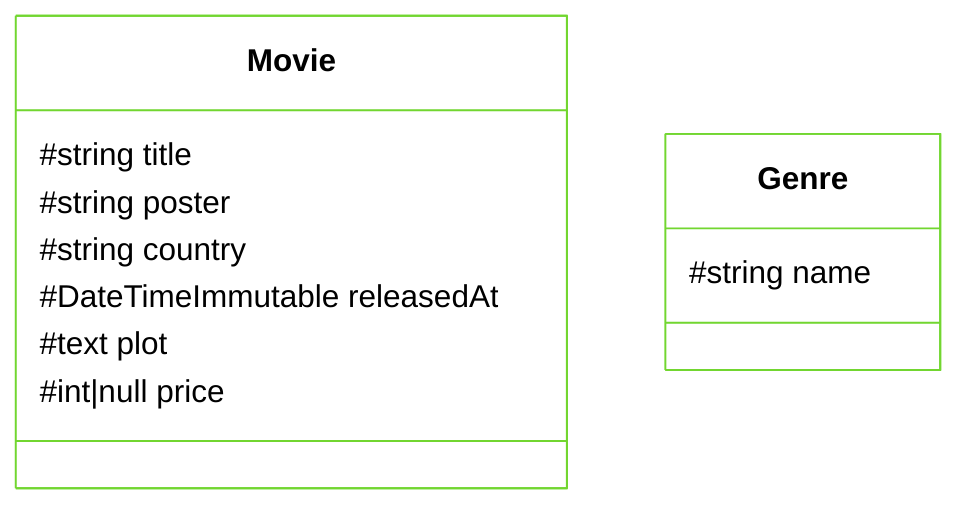

# Migrations

<div class="h-lg vertical-content">

* Migrations allow for a safe upgrade/downgrade of table definitions (up or down methods)
* All your operations are stored in versioned files (located in the migrations/ folder by default)
* Migrations are used as a more robust replacement do the command doctrine:schema:update

More here: https://www.doctrine-project.org/projects/doctrine-migrations/en/current/index.html

</div>

---

# Check your status

<div class="h-lg vertical-content">

* The previously seen command `doctrine:schema:validate` can be used to check the database connection and if the database schema is in sync with the mapping of your entities.
* You can also use the command `doctrine:mapping:info` to check the mapping information for each entity
* The `doctrine:migrations:status` command will give you informations on all the migrations of your system and their status

</div>

---

# Check your status

<div class="w-md mx-auto h-lg vertical-content">

```bash
# Check connection and db sync
$ symfony console doctrine:schema:validate

# Check your mapped entities
$ symfony console doctrine: mapping: info

# Overview about migrations
$ symfony console doctrine:migrations:status
```

</div>

---

# Generate a new migration

<div class="h-lg vertical-content">

When you make changes to your entities like adding or removing properties or changing their types, create a new migration to apply the changes to your database.

This can be done with the MakerBundle `make:migration` command, which is a shortcut for the `doctrine:migrations:diff` command.


</div>

---

# Generate a new migration

<div class="w-2xl mx-auto h-lg vertical-content">

```bash
$ symfony console make:migration

# or
$ symfony console doctrine:migrations:diff

# Check the file content.
# If not satisfied, gently remove the file instead of executing it
```

</div>

---

# Apply migrations

<div class="h-lg vertical-content">

To apply the changes in your migration file to the database, run the `doctrine:migrations:migrate` command.
This command will run every migration that’s not yet been run.
To run a specific migration, either its up or down method, use the `doctrine:migrations:execute` command with the `--up` or `--down` flag and the migration’s Fully Qualified Class Name

</div>

---

# Apply migrations

<div class="w-2xl mx-auto h-lg vertical-content">

```bash
$ symfony console doctrine:migrations:migrate

# If something’s wrong, rollback the last migration with
# its fully qualified classname
$ symfony console doctrine:migrations:execute {FQCN} --down
```

</div>

---

# Exercise

<div class="h-lg vertical-content">

1. Create new entities:
    * Movie
    * Genre
1. Generate a new migration.
1. Store both tables in your database.

</div>

---

# Exercise

<div class="h-lg vertical-content centered">



</div>
